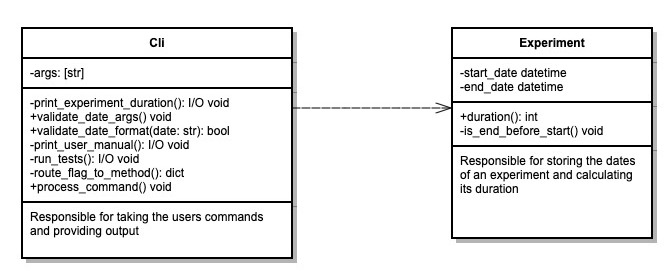

# Experiment Length Calculator (Explen) CLI

- [Introduction](#Introduction)
- [Getting Started](#Getting Started)
    - [Usage](#Usage)
    - [Arguments](#Arguments)
    - [Details to note](#Details to note)
    - [Testing via the CLI](#Testing via the CLI)
    - [Accessing help via the CLI](#Accessing help via the CLI)
- [Development](#Development)
    - [Running using python](#Running using python)
    - [Unit testing using python](#Unit testing using python)
- [Build](#Build)    
    - [Creating the binary](#Creating the binary)
- [Design](#Design)
    - [UML Diagram](#UML Diagram)

## Introduction
This cli has one function which expects 2 date arguments. It calculates how many days your experiment ran for.
The CLI is written in Python 3.8.7, with a single binary executable created via `pyinstaller`
The python source code includes a number of unit tests which can be run before compilation of the binary.
Alternatively, the CLI can be tested in situ using the `-test` flag.

## Getting Started
To use the CLI, all you need to do is add the explen executable to a location in your PATH variable. For example:<br/>
`cp dist/explen ~/../../usr/local/bin/explen`

### Usage
```
explen <experiment_start_date> <experiment_end_date> # run the main cli function
explen -test # run the cli tests
explen -help # view the user manual
```

### Arguments
Date arguments must be in d/m/yyyy or dd/mm/yyyy format.
Leading zeros for the month and day parameters are optional.

The experiment cannot end on a day before it started.

### Details to note
The first and last day of an experiment are never counted in the result.
Therefore, an experiment that ends the day after it started, has a length of zero days.

Examples of valid dates:
```
01/01/1111
1/01/1111
21/5/2021
31/12/9999
```
Usage Examples
```
explen 1/1/2021 3/1/2021
output: Length of experiment: 1 day

explen 7/6/1111 8/6/2020
output: Length of experiment: 0 days
```

### Testing via the CLI

The compiled CLI can be tested directly via the following command:

`explen -test`

### Accessing help via the CLI

The user manual can be viewed with the following command:

`explen -help`

## Development

### Running using python (pre-compilation)

The program has no external dependencies, so can be run from the command line as follows.
I used python 3.8.7 for development, but think you'll probably be ok with 3.6 or above, but it has not been tested.

`python3 date_counter 3/2/2020 5/2/2021`

### Unit testing using python

Unit testing uses external libraries, so you'll need to run<br>
`pip install -r requirements-test.txt`
It is recommended that you do this inside a virtual environment which can be setup as follows:

```
python3 -m venv venv
source venv/bin/activate
```

or, if you're using pyenv:

```
pyenv virtualenv 3.8.7 explen
pyenv activate explen
```

Now you can run the tests as follows:
```
python3 -m pytest test/test_experiment.py
python3 -m pytest test/test_cli.py
```

## Build

### Creating the binary

```
pip install pyinstaller
pyinstaller --onefile --windowed explen.py
```

If you're running in a pyenv environment, you may need to install your python version with framework support as follows*:

`env PYTHON_CONFIGURE_OPTS="--enable-framework" pyenv install 3.8.7`

*more info in the [pyenv docs](https://github.com/pyenv/pyenv/wiki#how-to-build-cpython-with---enable-shared)

When the process is completed, the explen executable will have been created in a `dist` directory.<br/>
Move it to a directory in your shell path and you're good to go!

## Design

### UML Diagram


